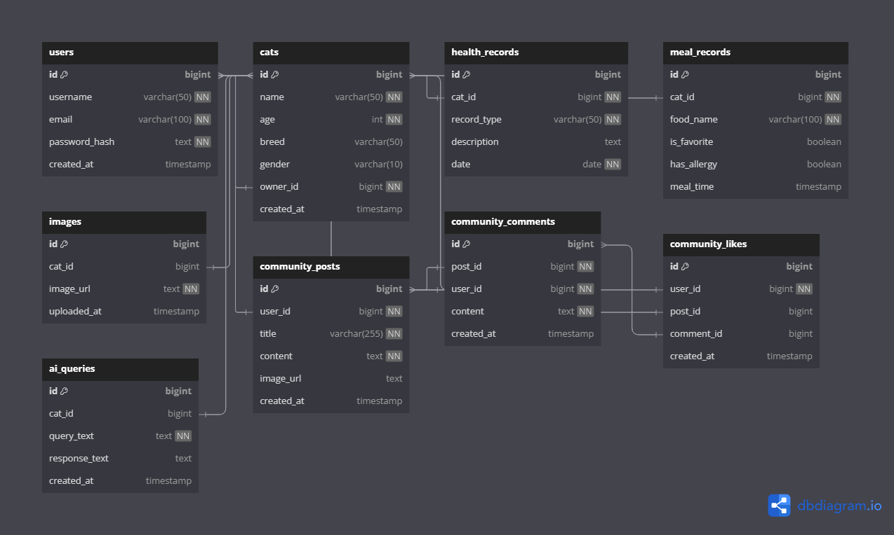

# 🐾 MeowDiary Database Schema

## 📖 프로젝트 개요
MeowDiary는 **고양이의 건강과 생활을 관리**하고, **커뮤니티에서 정보를 공유**할 수 있는 서비스를 목표로 합니다.  
이 데이터베이스는 사용자와 고양이의 프로필, 건강 및 식단 기록, 커뮤니티 기능을 지원합니다. 
더 나아가 나중에는 LLM을 붙여서 고양이의 건강 상태에 대한 조언의 답을 받을 수 있게 학습 시킬 예정입니다. 더 나아가서 변의 상태 분석하는 것으로 확장시키는 것을 목표시합니다.

---

## 📌 데이터베이스 개요
 **이용자-고양이-기록-커뮤니티**를 중심으로 다음과 같이 구성

- **사용자(users)**: MeowDiary 플랫폼의 회원 정보 관리
- **고양이 프로필(cats)**: 사용자별 반려묘 정보 관리
- **건강 기록(health_records)**: 고양이의 건강 정보 저장
- **식단 기록(meal_records)**: 고양이가 먹은 음식과 특성 기록
- **이미지(images)**: 고양이의 사진 저장
- **커뮤니티(community_posts, community_comments, community_likes)**: 사용자 간의 소통 및 정보 공유
- **AI 분석(ai_queries)**: AI가 제공하는 고양이 관련 분석 서비스 저장

---

## 📂 데이터베이스 테이블 설명

### 1️⃣ 사용자 테이블 (`users`)
**역할**  
- MeowDiary 플랫폼의 사용자를 관리합니다.
- 커뮤니티 활동 및 고양이 정보와 연결됩니다.

**주요 컬럼**
- `id` (**PK**) - 사용자 고유 ID
- `username` - 사용자 이름 (유니크)
- `email` - 사용자 이메일 (유니크)
- `password_hash` - 암호화된 비밀번호
- `created_at` - 계정 생성 시각

---

### 2️⃣ 고양이 프로필 테이블 (`cats`)
**역할**  
- 각 사용자가 등록한 반려묘의 정보를 저장합니다.
- 건강, 식단, AI 분석 데이터와 연결됩니다.

**주요 컬럼**
- `id` (**PK**) - 고양이 고유 ID
- `name` - 고양이 이름
- `age` - 고양이 나이
- `breed` - 품종
- `gender` - 성별 (M/F/Other)
- `owner_id` (**FK**) - 소유자 ID (`users.id` 참조)
- `created_at` - 프로필 생성 시각

**🔗 관계**
- `users` 테이블과 **1:N 관계**  
  → 한 사용자는 여러 마리의 고양이를 등록할 수 있음.

---

### 3️⃣ 건강 기록 테이블 (`health_records`)
**역할**  
- 고양이의 건강 관련 정보를 저장합니다.
- 예방접종, 정기 검진 등의 기록을 남길 수 있습니다.

**주요 컬럼**
- `id` (**PK**) - 건강 기록 고유 ID
- `cat_id` (**FK**) - 해당 고양이 ID (`cats.id` 참조)
- `record_type` - 기록 유형 (예: 예방접종, 검사 등)
- `description` - 상세 설명
- `date` - 건강 기록 날짜

**🔗 관계**
- `cats` 테이블과 **1:N 관계**  
  → 한 고양이는 여러 개의 건강 기록을 가질 수 있음.

---

### 4️⃣ 식단 기록 테이블 (`meal_records`)
**역할**  
- 고양이가 먹은 음식과 반응(알레르기, 선호도 등)을 저장합니다.

**주요 컬럼**
- `id` (**PK**) - 식단 기록 고유 ID
- `cat_id` (**FK**) - 해당 고양이 ID (`cats.id` 참조)
- `food_name` - 음식 이름
- `is_favorite` - 즐겨먹는 음식 여부 (Boolean)
- `has_allergy` - 알레르기 여부 (Boolean)
- `meal_time` - 식사 기록 시각

**🔗 관계**
- `cats` 테이블과 **1:N 관계**  
  → 한 고양이는 여러 개의 식단 기록을 가질 수 있음.

---

### 5️⃣ 이미지 테이블 (`images`)
**역할**  
- 고양이의 사진을 저장하고 관리합니다.

**주요 컬럼**
- `id` (**PK**) - 이미지 고유 ID
- `cat_id` (**FK**, nullable) - 해당 고양이 ID (`cats.id` 참조)
- `image_url` - 이미지 파일 경로
- `uploaded_at` - 업로드 시각

**🔗 관계**
- `cats` 테이블과 **1:N 관계**  
  → 고양이 1마리에 대해 여러 장의 사진을 저장할 수 있음.

---

### 6️⃣ 커뮤니티 게시글 테이블 (`community_posts`)
**역할**  
- 사용자가 게시한 커뮤니티 글을 저장합니다.

**주요 컬럼**
- `id` (**PK**) - 게시글 고유 ID
- `user_id` (**FK**) - 작성자 ID (`users.id` 참조)
- `title` - 게시글 제목
- `content` - 게시글 내용
- `image_url` - 첨부 이미지 URL
- `created_at` - 게시글 작성 시각

**🔗 관계**
- `users` 테이블과 **1:N 관계**  
  → 한 사용자는 여러 개의 게시글을 작성할 수 있음.

---

### 7️⃣ 커뮤니티 댓글 테이블 (`community_comments`)
**역할**  
- 커뮤니티 게시글에 대한 댓글을 저장합니다.

**주요 컬럼**
- `id` (**PK**) - 댓글 고유 ID
- `post_id` (**FK**) - 대상 게시글 ID (`community_posts.id` 참조)
- `user_id` (**FK**) - 댓글 작성자 ID (`users.id` 참조)
- `content` - 댓글 내용
- `created_at` - 댓글 작성 시각

**🔗 관계**
- `community_posts` 테이블과 **1:N 관계**  
  → 하나의 게시글에 여러 개의 댓글이 달릴 수 있음.
- `users` 테이블과 **1:N 관계**  
  → 한 사용자는 여러 개의 댓글을 작성할 수 있음.

---

### 8️⃣ 좋아요 테이블 (`community_likes`)
**역할**  
- 게시글 또는 댓글에 대한 좋아요(추천)를 저장합니다.

**주요 컬럼**
- `id` (**PK**) - 좋아요 고유 ID
- `user_id` (**FK**) - 좋아요를 누른 사용자 ID (`users.id` 참조)
- `post_id` (**FK**, nullable) - 게시글 ID (`community_posts.id` 참조)
- `comment_id` (**FK**, nullable) - 댓글 ID (`community_comments.id` 참조)
- `created_at` - 좋아요 생성 시각

**🔗 관계**
- `users` 테이블과 **1:N 관계**  
  → 한 사용자는 여러 개의 좋아요를 누를 수 있음.
- `community_posts` 및 `community_comments` 중 하나와 연결됨.

---

### 9️⃣ AI 분석 테이블 (`ai_queries`)
**역할**  
- AI가 분석한 데이터를 저장합니다.

**주요 컬럼**
- `id` (**PK**) - AI 쿼리 고유 ID
- `cat_id` (**FK**, nullable) - 분석 대상 고양이 ID (`cats.id` 참조)
- `query_text` - AI에게 보낸 쿼리
- `response_text` - AI 응답 결과
- `created_at` - 쿼리 생성 시각

**🔗 관계**
- `cats` 테이블과 **1:N 관계**  
  → 한 고양이에 대해 여러 개의 AI 분석 기록을 저장할 수 있음.

## 📂 API 명세
[🔗 포스트맨](https://documenter.getpostman.com/view/29669858/2sAYk8v3h8)

